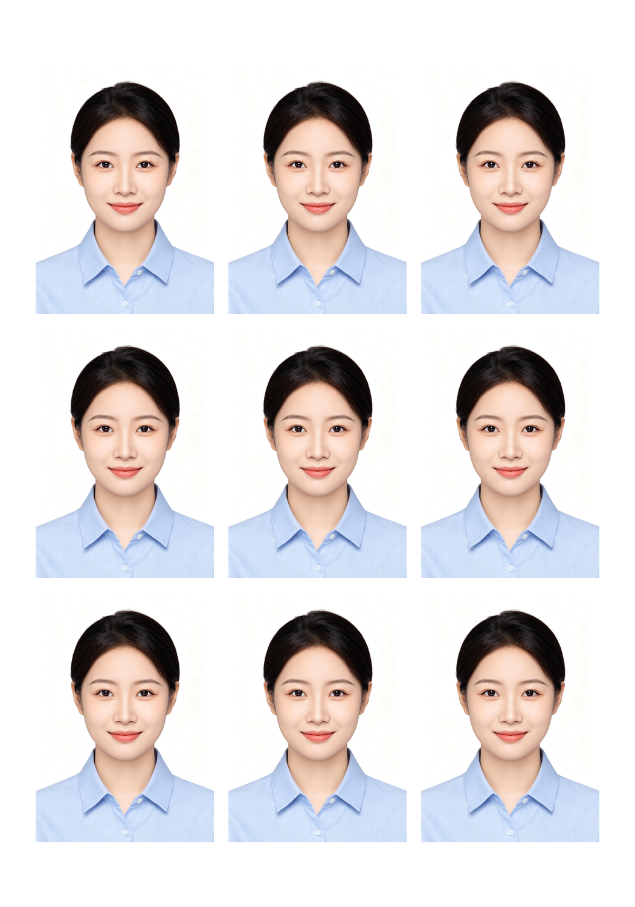

<p align="center">
  <h1 align="center">🪪 photo-toolbox</h1>
  <p align="center">让 AI 帮你在家打证件照：一张人像照 → 自动裁成一寸/二寸 → 按 5 寸/6 寸相纸排好版，300dpi 直接打印，不用跑照相馆。</p>
</p>

<p align="center">
  <a href="LICENSE"></a>
  
  
  
</p>

<p align="center">
  <a href="#预览">预览</a> · <a href="#功能一览">功能</a> · <a href="#安装">安装</a> · <a href="#首次使用引导">首次使用引导</a> · <a href="#局限limitations">局限</a> · <a href="#许可证">License</a>
</p>

---

## 预览

一张人像照进来，一张可打印的相纸出去：



<sub>一寸证件照 × 5 寸相纸（3×3 = 9 张，300dpi）。上图是脚本的真实输出，不是示意图。</sub>

---

一个开源的**照片处理技能**（Skill），给 AI Agent（豆包工作等支持 Skills 的运行时）提供四类照片处理能力：

1. **证件照排版**（主打）—— 人像自动裁切成证件照规格（一寸/二寸/大一寸），按 5 寸/6 寸相纸排版成一张可打印图，300dpi 打印标准
2. **照片排版 PDF** —— 多张照片按每页张数自动排成网格，导出 A4 等页面 PDF
3. **照片排版 Word** —— 照片排成 Word，每张图下预留空行写价格 / 备注
4. **照片加水印** —— 批量加文字水印（默认正中偏下，支持右下角斜放、居中大字、平铺防盗）

**特色**：用户第一次使用时，Agent 会主动发起一连串引导问题，收集**默认排版格式**和**水印要求**并保存到 `user-preferences.json`，之后每次按用户偏好执行，不用重复说明。

---

## 目录结构

```
photo-toolbox/
├── SKILL.md                      # 技能定义（Agent 行为规范，含首次使用引导流程）
├── user-preferences.json.example # 偏好配置模板（首次引导后生成 user-preferences.json）
├── scripts/
│   ├── layout_id_photo.py        # 功能一：证件照排版（主打，裁切+相纸排版）
│   ├── layout_photos.py          # 功能二：照片排版 PDF
│   ├── layout_photos_word.py     # 功能三：照片排版 Word（带备注行）
│   └── add_watermark.py          # 功能四：照片加水印
├── docs/
│   └── preview-id-photo.png      # README 首屏预览图（脚本真实输出）
├── references/                   # 反馈与版本记录
└── test-prompts.json             # 测试基准（17 个典型用例）
```

## 功能一览

| 功能 | 脚本 | 输出 | 典型场景 |
|------|------|------|---------|
| 证件照排版（主打） | `layout_id_photo.py` | .png | 在家打印一寸/二寸证件照 |
| 照片排版 PDF | `layout_photos.py` | .pdf | 照片整理、分享、存档 |
| 照片排版 Word | `layout_photos_word.py` | .docx | 报价单、商品图册、照片说明 |
| 照片加水印 | `add_watermark.py` | .jpg/.png | 宣传发布、版权保护、样品标注 |

## 局限（Limitations）

先说清楚这东西**不做**什么，免得装完失望：

- **不做 AI 抠图 / 人脸检测**：证件照只做比例裁切 + 相纸排版，不会自动换背景。背景不纯的照片需要抠图时，本工具不适用。
- **依赖本地 Python 环境**：需要先安装 `pillow reportlab python-docx`；机器上没有 Python 就用不了。
- **只能在支持 Skills 且能执行本地脚本的 Agent 运行时使用**（如豆包工作电脑版 · 本地电脑模式）。网页端 / 手机端 Agent 无法执行本地脚本。
- **证件照头部位置是默认值**（`--head-offset 0.12` 头部靠上）：不同照片差异大，打印前请目视核对一次，必要时用 `--head-offset` 微调。
- **水印只支持文字**：不提供图形 logo 水印，也不提供去水印功能。

## 安装

### 作为 Skill 安装到豆包工作电脑版

1. 把整个 `photo-toolbox` 文件夹放到豆包工作电脑版的**用户技能目录**下（如 `.user_skills/`）
2. 重启豆包工作电脑版
3. 首次使用前安装 Python 依赖：
   ```bash
   pip3 install pillow reportlab python-docx
   ```
4. 回到对话直接使用（本技能在本地电脑模式下运行脚本）

### 独立使用脚本（不经过 Agent）

```bash
# 证件照排版（一寸 + 5寸相纸，打印用 300dpi）
python3 scripts/layout_id_photo.py 人像照.jpg --spec 1寸 --paper 5寸 -o id_sheet.png

# PDF 排版
python3 scripts/layout_photos.py 照片1.jpg 照片2.jpg ... --output out.pdf --per-page 9

# Word 排版（图下留备注）
python3 scripts/layout_photos_word.py 照片... --output out.docx --per-page 6 --note-lines 2

# 加水印
python3 scripts/add_watermark.py 照片... --text "© My Brand" --position center-low
```

## 首次使用引导

首次使用时，Agent 会依次询问：

- **PDF 排版偏好**：每页几张？纸张大小？照片按方向分组吗？
- **Word 排版偏好**：每页几张？图下留几行备注？
- **水印偏好**：默认加水印吗？文字是什么？放哪？斜不斜？
- **证件照偏好**：默认证件照规格？常用相纸？

用户可直接回答"跳过 / 用默认"。偏好保存到 `user-preferences.json`，之后每次执行自动按偏好来，用户说「重新设置照片偏好」即可重新引导。

> 参考：`user-preferences.json.example` 是完整字段说明，也可手动编辑 `user-preferences.json`。

## 依赖

- Python 3
- Pillow（必需）
- reportlab（PDF 排版）
- python-docx（Word 排版）

## 测试

`test-prompts.json` 内置 17 个典型用例，覆盖 PDF 排版（7）、Word 排版（2）、水印（5）、首次引导（1）、证件照（2）。可按用例逐条验证输出。

## 许可证

[MIT](LICENSE)
